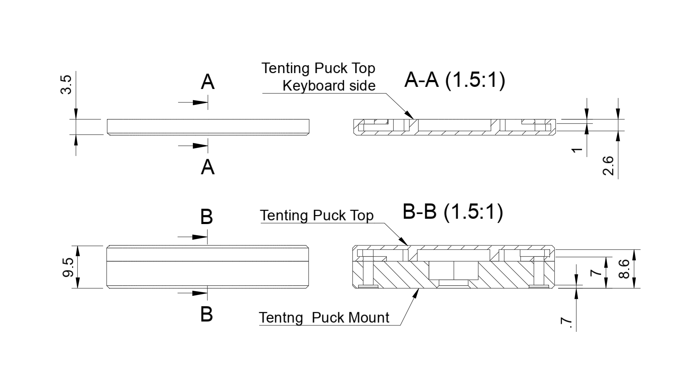

# Magnet Tenting Puck for split keyboards

Inspired by [tenting puck](https://splitkb.com/products/tenting-puck) from [splitkb.com](https://splitkb.com).

## How-To: Without Magnets

### Required parts
   - Screw:
     - For keyboard case: M2 screws of sufficient length (add 3mm to the thickness of your case)
   - Nuts:
     - M2 flat hex nut (thin) x 8
     - 1/4-20 UNC flat hex nut x 2
   - Tenting Puck Mount: chooes one of below
     - [MagSafe Compatible Tenting Puck Mount](3d-printing/stl/TP-SLA-Mount.stl) x 2
     - [Tenting Puck Mount](3d-printing/stl/TP-SLA-Mount.stl) x 2

### Steps
1. Print Tenting Puck Mounts: Resin printing is recommended for keyboard side.
1. Assmble Tenting Puck Mount
   1. Place the 1/4 nut into the hole.
   1. Insert M2 nuts into the holes and align them with the screw hole.
   1. Align screw holes of the mount with your keyboard case or plate.
   1. Insert M2 screws through your keyboard case and screw them.
   1. Install the mount onto any camera tri-pod.
   
   
1. Enjoy!

## How-To: With magnets

### Required parts
   - Screw:
     - tenting parts : M2 x 8mm x 8
     - For Keyboard case : M2 screws of sufficient length (add 2mm to the thickness of your case)
   - Nuts:
     - M2 flat hex nut (thin) x 16
     - 1/4-20 UNC flat hex nut x 2
   - Tenting Puck parts: choose one of below
     - Coin Magnets version: choose one of below
       - [Tenting Puck Top v1](3d-printing/stl/TP-SLA-Top-16x2-13x2.stl) x 4
         - Magnets
           - 16mm x 2 mm x 4
           - 13mm x 2 mm x 16 (optional)
       - [Tenting Puck Top v2](3d-printing/stl/TP-SLA-Top-15x2-12x2.stl) uses smallier magenets: 15mm and 12mm
       - [Tenting Puck Mount](3d-printing/stl/TP-SLA-Mount.stl) x 2
     - MagSafe version
       - [MagSafe Magnet Tenting Puck Top](3d-printing/stl/TPMS-SLA-D57-Magnet.stl) x 2
         - MagSafe Magnet x 2
       - [MagSafe Compatible Tenting Puck Mount](3d-printing/stl/TPMS-SLA-D57-Ring-Mount.stl) x 2
       - [MagSafe Ring Tenting Puck Top](3d-printing/stl/TPMS-SLA-D57-Ring.stl) x 2
         - MagSafe Ring x 2
### Steps
1. Print Tenting Puck Tops and Mounts: Resin printing is recommended for keyboard side.
1. Assemble Tenting Puck Top
   1. Insert magnets into holes on the Tenting Puck Top
   1. Insert M2 nuts into the holes and align them with the screw holes.
   1. Repeat for each side.
1. Assemble Tenting Puck Mount
   1. Place the 1/4 nut into the hole.
   1. Align screw holes of the mount 
   1. Insert M2 screws through the Tenting Mount and secure them with one of Tenting Puck Tops (for MagSafe version, use MagSafe Magnet Tenting Puck Top).
   1. Install the mount onto any camera tri-pod.
1. Attach one of Tenting Tops to your keyboard case with M2 screws (for MagSafe version, use MagSafe Ring Tenting Puck Top).
   
   
1. Enjoy!

## Visuals
### Video
    
    
### Tenting Puck Mount
   
### Tenting Puck Top
   

